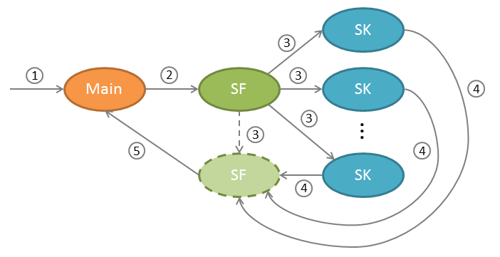

# Actorbase
Implementation of a key-value NoSQL database using the actor-model.

The reference model is described in this post on my technical blog:
[Actorbase or "the persistence chaos"](http://rcardin.github.io/database/actor-model/reactive/akka/scala/2016/02/07/actorbase-or-the-persistence-chaos.html)

## Communication model
Using the notation defined in the Appendix A of Roland Kuhn's book, [Reactive Design Patterns](https://www.reactivedesignpatterns.com/),
the communication model developed among main actors of Actorbase can be summarize as the following.

As the above mode shows, using the Cameo Pattern every instance of a two-phase commit (2PC) between actors was removed.
This kind of design should let the Actorbase architecture to easily scale horizontally.

## Available implementations
The reference model was also implemented by other teams of developers as
a *p.o.c.* project made during the [Software Engineering](http://www.math.unipd.it/~tullio/IS-1/2015/Progetto/C1.pdf)
course at the Department of Mathematics of the University of Padova.

The currently available implementations are:

 - [SweeneyThreads Actorbase](http://sweeneythreads.github.io/actorbase/)
 - [ScalateKids Actorbase](https://github.com/ScalateKids/Actorbase)

